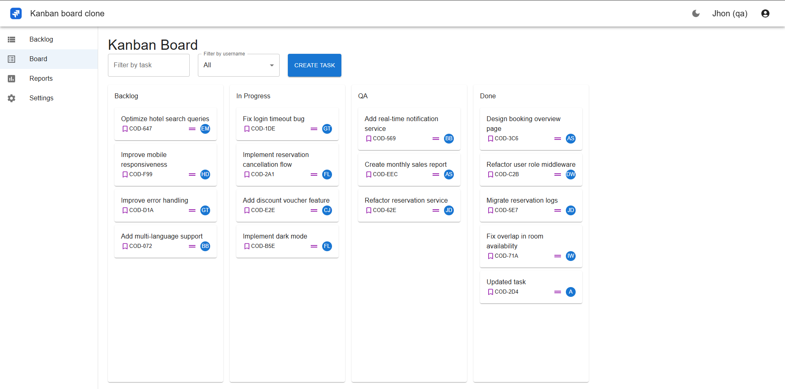

# Kanban Board Clone

### Video Demo: [Kanban board clone](https://youtu.be/W1nFLfRXti8)


---

**Kanban**-style application built in **React**, allowing you to manage tasks with specific roles and validations. Includes authentication, role selection, and theme customization.

## 🚀 Key features

- **Login** using the Platzi API, with role selection: **DEV** or **QA**.
- **State management with Redux**, persisting data in **LocalStorage**.
- **Kanban board** with columns and tasks loaded from LocalStorage.
- **Create tasks** using a simple form with validations.
- **Update tasks** by clicking anywhere on the card _except the name_.
- **Drag & Drop**:
  - You can only drag by clicking on the task **name**.
  - Validations based on user role for moving tasks between columns.
- **Filters** by task name or assigned user.
- **Change theme** (light/dark) by clicking on the icon in the upper right corner.
- **Log out** by clicking on the current user's avatar.

## 🛠️ Tools used

- **React**
- **Redux Toolkit**
- **LocalStorage**
- **Platzi API** for:
  - Authentication
  - List of assignable users

## ▶️ How to execute the project

```bash
npm install
npm run dev
```

---

Aplicación tipo **Kanban** construida en **React**, que permite gestionar tareas con roles y validaciones específicas. Incluye autenticación, selección de rol y personalización del tema.

## 🚀 Funcionalidades principales

- **Login** usando la API de Platzi, con selección de rol: **DEV** o **QA**.
- **Gestión del estado con Redux**, persistiendo datos en **LocalStorage**.
- **Tablero Kanban** con columnas y tareas cargadas desde LocalStorage.
- **Crear tareas** mediante un formulario sencillo con validaciones.
- **Actualizar tareas** haciendo clic en cualquier parte del card _excepto en el nombre_.
- **Drag & Drop**:
  - Solo se puede arrastrar haciendo clic en el **nombre** de la tarea.
  - Validaciones según el rol del usuario para mover tareas entre columnas.
- **Filtros** por nombre de tarea o usuario asignado.
- **Cambio de tema** (claro / oscuro) clic en el icono superior derecho.
- **Cerrar sesión** haciendo clic en el avatar del usuario actual.

## 🛠️ Herramientas utilizadas

- **React**
- **Redux Toolkit**
- **LocalStorage**
- **API de Platzi** para:
  - Autenticación
  - Listado de usuarios asignables

## ▶️ Cómo ejecutar el proyecto

```bash
npm install
npm run dev
```
